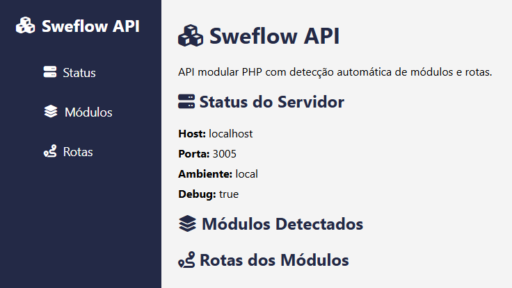

# Sweflow API



## Sobre
A Sweflow API é uma API modular desenvolvida em PHP, com arquitetura profissional, suporte a múltiplos bancos de dados e autenticação JWT. Permite fácil extensão de módulos e integração com sistemas web modernos.

## Principais Recursos
- Estrutura modular (Controllers, Services, Repositories, Entities)
- Suporte a PostgreSQL e MySQL
- Autenticação JWT
- Rotas públicas e protegidas
- Upload de imagens
- Configuração via .env
- Respostas padronizadas em JSON

## Instalação
1. Clone o repositório:
   ```bash
   git clone https://github.com/sweflow/api_sweflow_php.git
   ```
2. Instale as dependências:
   ```bash
   composer install
   ```
3. Instale a extensão do banco de dados no PHP:
   - Para PostgreSQL:
     ```bash
     sudo apt-get install php-pgsql
     # ou no Windows, habilite a extensão 'php_pgsql' no php.ini
     ```
   - Para MySQL:
     ```bash
     sudo apt-get install php-mysql
     # ou no Windows, habilite a extensão 'php_mysqli' no php.ini
     ```
4. Configure o arquivo `.env` conforme o exemplo em `EXEMPLO.env`.
5. Crie as tabelas no banco de dados conforme o modelo em `docs/database.sql`.
6. Inicie o servidor:
   ```bash
   php -S localhost:3005 index.php
   ```

## Endpoints Principais
- `POST /criar/usuario` — Criação de usuário
- `GET /api/usuarios` — Listagem pública de usuários
- `PUT /usuario/{uuid}` — Atualização de usuário
- `PATCH /api/usuario/{uuid}/ativar` — Ativar usuário
- `PATCH /api/usuario/{uuid}/desativar` — Desativar usuário
- `DELETE /api/usuario/{uuid}` — Excluir usuário
- `GET /usuario/{uuid}` — Buscar usuário por UUID

## Estrutura de Pastas
```
├── public/
│   ├── assets/
│   │   ├── imgs/
│   │   │   └── logo.png
│   │   └── ...
├── src/
│   ├── Modules/
│   │   └── Usuario/
│   │       ├── Controllers/
│   │       ├── Entities/
│   │       ├── Repositories/
│   │       ├── Services/
│   │       └── ...
│   └── ...
├── index.php
├── composer.json
└── ...
```

## Licença
MIT

---
Sweflow API © 2026
