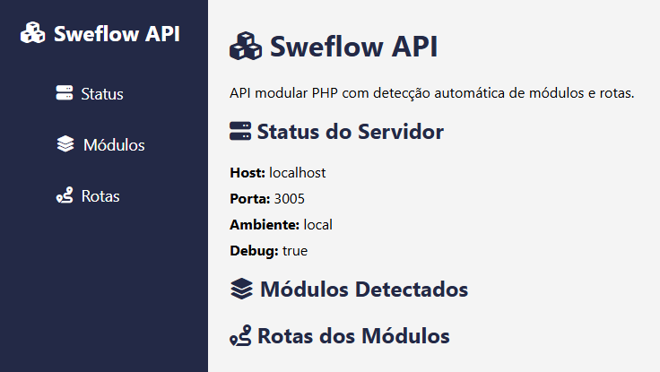

# Sweflow API



## Sobre
A Sweflow API é uma API modular desenvolvida em PHP, com arquitetura profissional, suporte a múltiplos bancos de dados e autenticação JWT. Permite fácil extensão de módulos e integração com sistemas web modernos.

## Principais Recursos
- Estrutura modular (Controllers, Services, Repositories, Entities)
- Suporte a PostgreSQL e MySQL
- Autenticação JWT
- Rotas públicas e protegidas
- Upload de imagens
- Configuração via .env
- Respostas padronizadas em JSON

## Requisitos
- PHP 8.2+ e Composer
- Extensões PHP:
  - PostgreSQL: `pdo_pgsql` / `pgsql`
  - MySQL: `pdo_mysql` / `mysqli`
- Banco: PostgreSQL ou MySQL

## Instalação (rápida)
Clone e instale dependências:

```bash
git clone https://github.com/sweflow/api_sweflow_php.git
cd api_sweflow_php
composer install
```

Crie o `.env`:

```bash
cp EXEMPLO.env .env
```

Edite as variáveis principais (exemplo):
- `APP_PORT=3005`
- `DB_CONEXAO=postgresql` (ou `mysql`)
- `DB_HOST`, `DB_PORT`, `DB_NOME`, `DB_USUARIO`, `DB_SENHA`
- `JWT_SECRET` e `JWT_API_SECRET`

## Setup automatizado (um comando)
Para rodar tudo automaticamente no servidor (gera secrets JWT se estiverem vazios, cria banco via Docker, migra, seed e inicia servidor):

```bash
php sweflow setup --auto --db-mode=docker --server=php --jwt=if-empty
```

Ajuda do setup:

```bash
php sweflow setup --help
```

## Banco de dados, migrations e seed
O projeto possui um runner de banco chamado `db` (na raiz do repositório):

```bash
php db
```

Comandos:

```bash
php db migrate   # migrations de módulos + plugins
php db seed      # seeders de módulos + plugins
php db rollback  # rollback da última migration de módulos
```

Plugins (migrations apenas de plugins):

```bash
php sweflow plugin:migrate
php sweflow plugin:rollback NOME_DO_PLUGIN
```

Import rápido via SQL (opcional):
- `src/Kernel/Database/sweflow_db_2026-03-02_013709.sql`

## Rodar o servidor
Servidor embutido do PHP:

```bash
php -S 0.0.0.0:3005 index.php
```

Com PM2 (produção):

```bash
pm2 start php --name sweflow-api -- -S 0.0.0.0:3005 index.php
pm2 save
pm2 logs sweflow-api --lines 200
```

## JWT (secrets e token de API)
Gerar `JWT_SECRET` e `JWT_API_SECRET` se estiverem vazios (via setup):

```bash
php sweflow setup
```

Gerar um token JWT de API (1h) a partir de `JWT_API_SECRET`:

```bash
php gerar_jwt.php
```

## Endpoints Principais
- `POST /criar/usuario` — Criação de usuário
- `GET /api/usuarios` — Listagem pública de usuários
- `PUT /usuario/{uuid}` — Atualização de usuário
- `PATCH /api/usuario/{uuid}/ativar` — Ativar usuário
- `PATCH /api/usuario/{uuid}/desativar` — Desativar usuário
- `DELETE /api/usuario/{uuid}` — Excluir usuário
- `GET /usuario/{uuid}` — Buscar usuário por UUID
- `POST /api/auth/login` — Autenticação e emissão de cookie HttpOnly
- `GET /api/auth/me` — Retorna o usuário autenticado a partir do cookie JWT
- `POST /api/auth/logout` — Remove o cookie de autenticação

## Estrutura de Pastas
```
├── public/
│   ├── assets/
│   │   ├── imgs/
│   │   │   └── logo.png
│   │   └── ...
├── src/
│   ├── Modules/
│   │   └── Usuario/
│   │       ├── Controllers/
│   │       ├── Entities/
│   │       ├── Repositories/
│   │       ├── Services/
│   │       └── ...
│   └── ...
├── index.php
├── composer.json
└── ...
```

## Licença
MIT

---
Sweflow API © 2026
